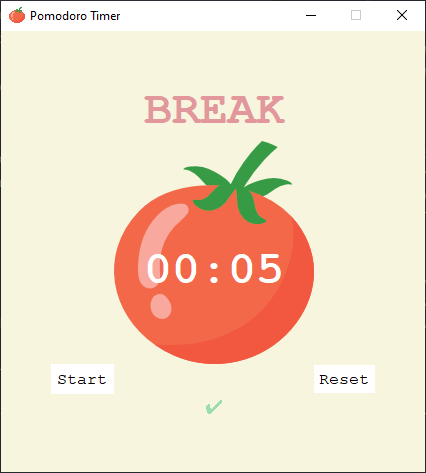
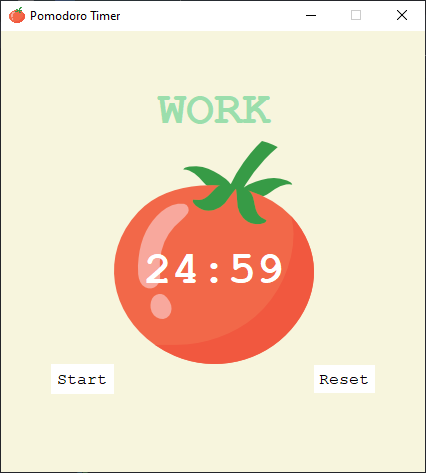

# Pomodoro Timer

A simple Pomodoro Timer application built using Python and Tkinter to help you manage your time effectively using the Pomodoro Technique. This app allows you to focus on work sessions with regular short and long breaks, boosting productivity and focus.

## Table of Contents
- [Features](#features)
- [Screenshots](#screenshots)
- [Installation](#installation)
- [Usage](#usage)
- [Configuration](#configuration)
- [Technologies](#technologies)
- [Contributing](#contributing)
- [Acknowledgments](#acknowledgments)

## Features
- **Automatic Session Switching**: Automatically transitions between work and break intervals.
- **Sound Alerts**: Plays a sound at the end of each interval to notify you.
- **Progress Tracking**: Displays check marks to track completed work sessions.
- **User-Friendly Interface**: Simple, visually appealing UI with clear labels.

## Screenshots
  

## Installation
### Prerequisites
- Python 3.x installed on your machine.
- `Tkinter` library (pre-installed with Python on most systems).
- `winsound` library (for Windows sound alerts).

### Clone the Repository
Clone this repository to your local machine:
```bash
git clone https://github.com/SafwatSadiq/Pomodoro-Timer.git
cd pomodoro-timer
```

## Usage
1. Run the `pomodoro.py` file:
   ```bash
   python pomodoro.py
   ```

2. **Start the Timer**: Click the "Start" button to begin your work session.

3. **Reset the Timer**: Click "Reset" to stop the timer and reset the session count.

4. **Automatic Notifications**: When a session ends, a sound will play to notify you to take a break or resume work.

## Configuration
To adjust the duration of the work and break intervals, you can modify these constants in `pomodoro.py`:
```python
WORK_MIN = 25        # Set work session duration in minutes
SHORT_BREAK_MIN = 5   # Set short break duration in minutes
LONG_BREAK_MIN = 20   # Set long break duration in minutes
```

## Technologies
- **Python 3.x**
- **Tkinter**: for GUI development
- **winsound**: for sound alerts on Windows

## Contributing
Contributions are welcome! To contribute:
1. Fork the repository.
2. Create a new branch for your feature: `git checkout -b feature-name`
3. Commit your changes: `git commit -m 'Add feature'`
4. Push to the branch: `git push origin feature-name`
5. Open a pull request.

## Acknowledgments
- The Pomodoro Technique was developed by Francesco Cirillo.
- Thanks to the Python community for helpful libraries and resources.